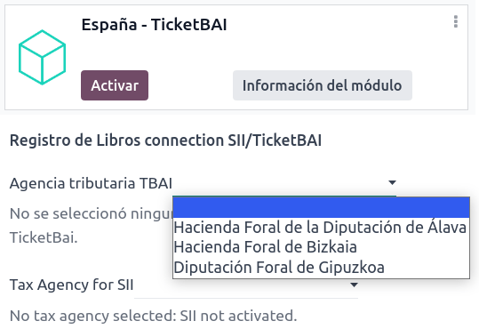
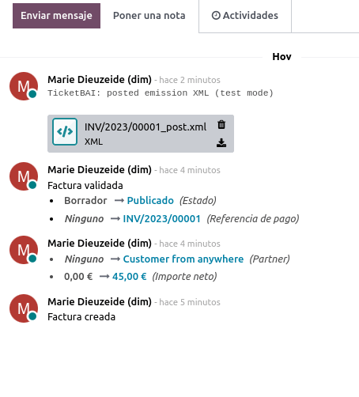

=====
Spain
=====

Configuration
=============

Install the 🇪🇸 **Spanish** :doc:`fiscal localization package <../fiscal_localizations>` to get all
the default accounting features of the Spanish localization.

Chart of accounts
=================

You can reach the **Chart of Accounts** by going to :menuselection:`Accounting --> Configuration -->
Accounting: Chart of Accounts`.

The **Spanish** chart of accounts includes pre-configured accounts by default:

- PGCE PYMEs 2008;
- PGCE Completo 2008;
- PGCE Entitades.

To select the one to use, go to :menuselection:`Accounting --> Configuration --> Settings`, and
select a package in the :guilabel:`Fiscal localization` section.

.. tip::
    When you create a new Odoo Online database, the PGCE PYMEs 2008 is installed by default.

.. warning::
   You can only change the accounting package as long as you have not created any accounting entry.

Taxes
=====

Default Spanish taxes are created automatically when the
:guilabel:`Spanish - Accounting (PGCE 2008)`, and the :guilabel:`Spanish - Accounting (PGCE 2008)`
modules are installed.  Each tax impacts the Spanish **Tax Reports (Modelo)**, available by going to
:menuselection:`Accounting --> Reporting --> Statements Reports: Tax Report`.

Reports
=======

Here is the list of Spanish-specific reports available:

- Balance Sheet;
- Profit & Loss;
- EC Sales List;
- Tax Report (Modelo 111);
- Tax Report (Modelo 115);
- Tax Report (Modelo 303);
- Tax Report (Modelo 347);
- Tax Report (Modelo 349);
- Tax Report (Modelo 390).

You can access Spanish-specific versions of reports by clicking on the **book** icon when on a
report and selecting its Spanish version: :guilabel:`(ES)`.

.. image:: spain/modelo-reports.png
   :alt: Spain-specific tax reports.

TicketBAI
=========

Configuration
-------------

Odoo supports the **TicketBAI (TBAI)** electronic invoicing format for all three regions of the
**Basque Country (Álava, Biscay, Gipuzkoa)**. To enable **TicketBAI**, make sure to first set the
:guilabel:`Country` and :guilabel:`Tax ID` of your company under :menuselection:`Settings -->
General Settings --> My Company` in the :guilabel:`Companies` section, and clicking
:guilabel:`Update Info`.

Then, make sure to have the module :guilabel:`Spain -TicketBAI (l10n_es_edi_TBAI)` installed. If not
installed, open **Apps**, search for the module and install it. Once installed, go to
:menuselection:`Settings --> Accounting --> Spain Localization (Section)` and select a **region** in
the :guilabel:`Tax Agency for TBAI` field.

Once a region selected, click :menuselection:`Manage certificates (SII/TicketBAI) --> New`, upload
the certificate provided by the tax agency and enter the password also provided by the agency.

.. image:: spain/certificate.png
   :alt: Password and validity of tax agency certificate.

.. tip::
   For **testing purposes**, these `three certificates <https://www.odoo.com/document/share/4844/85b5944d-abe2-4fb0-95e3-e663e8664111>`_
   are at your disposal. One certificate per region, with passwords indicated in the name (ex. the
   password for the Álava region is `1234`).

.. warning::
   If you are testing certificates, make sure to enable :guilabel:`Test Mode` under
   :menuselection:`Settings --> Accounting --> Spain Localization (Section)`.

Use case
--------

Once an invoice has been :doc:`created <../../finance/accounting/customer_invoices>` and confirmed,
a TicketBAI **banner** appears at the top. Odoo sends invoices through TicketBAI automatically every
**24 hours**. However, you can click :guilabel:`Process now` to send the invoice immediately.

.. image:: spain/ticketbai-invoice.png
   :alt: TicketBAI banner at the top of the invoice once sent.

When **sent**, the status of the field :guilabel:`Electronic Invoice` changes to :guilabel:`Sent`
and the XML file can be found in the **chatter** on the right. Under the :guilabel:`EDI Documents`,
you can see the traceability of other generated documents related to the invoice (ex. if the invoice
should also be sent through the **SII**, it will appear here).

.. note::
   The TBAI **QR code** is on the PDF of the invoice.

   .. image:: spain/qr-code.png
      :alt: QR code of the TicketBAI on the invoice.

FACe
====

Before configurating the :abbr:`FACe (Punto General de Entrada de Facturas Electrónicas)` system,
make sure to have the :guilabel:`Spain - Facturae EDI (l10n_es_edi_facturae)` module and other
related **Facturae EDI** modules installed. If not installed, you can install by going to **Apps**
and searching for `Facturae EDI`.

.. image:: spain/facturae-edi.png
   :alt: FACe module in Odoo.

To enable FACe, first set the :guilabel:`Country` and :guilabel:`Tax ID` of your company under
:menuselection:`Settings --> General Settings --> My Company` in the :guilabel:`Companies` section,
and clicking :guilabel:`Update Info`. Next, add the :guilabel:`Facturae signature certificate` by
clicking :guilabel:`Add a line` and uploading the certificate provided by the tax agency as well as
entering the password provided by the agency.

.. image:: spain/facturae-certificate.png
   :alt: Facturae certificate field in the company form.

.. note::
   For **testing purposes**, you can use `this certificate <https://www.odoo.com/document/share/5079/ec2a175d-537d-460f-b5cb-8f037c37c27a>`_.
   The **password** is: `test`.

Use case
--------

Once you have :doc:`created <../../finance/accounting/customer_invoices>` an invoice and confirmed
it, click :guilabel:`Send and Print`. Make sure :guilabel:`Generate Facturae edi file` is enabled,
and click :guilabel:`Send & Print` again. Once sent, the generated XML file is available in the
**chatter**.

.. image:: spain/facturae-checkbox.png
   :alt: Facturae EDI file checkbox when sending an invoice.

.. warning:
   The file is **NOT** automatically sent. You have to send it yourself manually.

.. tip::
   You can send **FACe** XML files in batch through `here <https://www.facturae.gob.es/formato/Paginas/descarga-aplicacion-escritorio.aspx>`_.

.. image:: spain/facturae-chatter.png
   :alt: XML file generated found in the chatter of the invoice.

Administrative centers
----------------------

In order for **FACe** to work with **administrative centers**, the invoice *must* include specific
data about the centers.

.. tip::
   Make sure to have the :guilabel:`Spain - Facturae EDI - Administrative Centers Patch
   (l10n_es_edi_facturae_adm_centers)` module installed.

To add **admnistrative centers**, create a new **contact** to add to the **partner** company. Select
:guilabel:`FACe Center` as **type**, assign one or more **role(s)** to that contact, and
:guilabel:`Save`. The **three** roles usually required are:

- Órgano gestor: :guilabel:`Receptor` (Receiver);
- Unidad tramitadora: :guilabel:`Pagador` (Payer);
- Oficina contable: :guilabel:`Fiscal` (Fiscal).

.. image:: spain/administrative-center.png
   :alt: Admnistrative center contact form for public entities.

.. tip:
   - If administrative centers need different :guilabel:`Codes` per role, you *need* to create
     different centers for each role.
   - When an electronic invoice is created using a partner with **administrative centers**, *all*
     administrative centers are included in the invoice.
   - You can add one contact with multiple roles or multiple contacts with a different role each.
