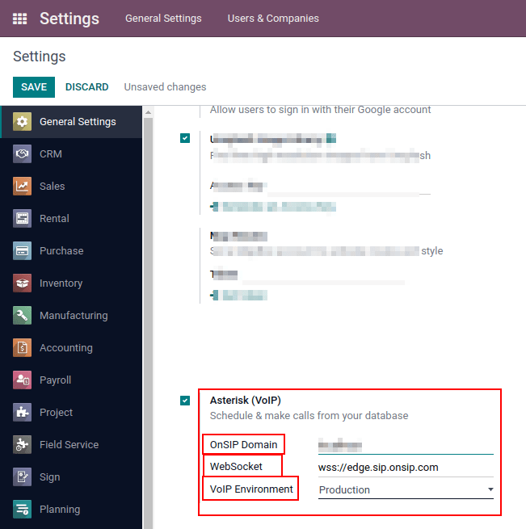

====================================
Use VoIP services in Odoo with OnSIP
====================================

Introduction
============

Odoo VoIP can be set up to work together with `OnSIP <https://www.onsip.com/>`_. OnSIP is a VoIP
provider. An account is needed with OnSIP to use this service. Before doing so, make sure that the
company's home area and the areas that will be called to are covered by OnSIP services. After
opening an OnSIP account, follow the configuration procedure below to configure on an Odoo database.

Configuration
=============

First, go to :menuselection:`Apps` and install the module *VoIP OnSIP*.

.. tip::
   Clear out the search bar and type in `onsip`. The OnSIP module will appear.

.. image:: onsip/install-onsip.png
   :align: center
   :alt: View of OnSIP app in the app search results.

Odoo VoIP setting
-----------------

Following the module installation, go to :menuselection:`Settings --> General Settings`. In the
:menuselection:`Integrations -- > Asterisk (VoIP)` section, fill in the three fields:

- :guilabel:`OnSIP Domain` is the domain that was assigned when creating an account on `OnSIP
  <https://www.onsip.com/>`_.
- :guilabel:`WebSocket` = `wss://edge.sip.onsip.com`
- :guilabel:`Mode` = :guilabel:`Production`

.. tip::
   To access the OnSIP domain, navigate to `OnSIP <https://www.onsip.com/>`_ and log in. Click on
   the :guilabel:`Administrative` link in the top-right of the page. Then, in the left menu, click
   on :guilabel:`Users` and then select any user. By default the user will open on the
   :guilabel:`User Info` tab. Click on the :guilabel:`Phone Settings` tab to reveal OnSIP
   configuration credentials. In the first column, last in the list of credentials, is
   :guilabel:`Domain`.

   .. image:: onsip/domain-setting.png
      :align: center
      :alt: Domain setting revealed (highlighted) on administrative panel of OnSIP management
            console.

Odoo user setting
-----------------

Next, the user will need to be set up in Odoo. Every user that will be associated with an OnSIP user
must also be configured in the Odoo user's settings/preferences.

First, navigate to :menuselection:`Settings --> Manage Users --> Select the User`. Once on the user
that the OnSIP account should be configured with, select :guilabel:`Edit`. Then click on the
:guilabel:`Preferences` tab and scroll to :guilabel:`VoIP Configuration`. In this section are the
fields that need to be filled in with OnSIP credentials.

.. tip::
   To access the OnSIP credentials, navigate to `OnSIP <https://www.onsip.com/>`_ and log in. Click
   on the :guilabel:`Administrative` link in the top-right of the page. Then, in the left menu,
   click on :guilabel:`Users` and then select the user. By default the user will open on the
   :guilabel:`User Info` tab. Click on the :guilabel:`Phone Settings` tab to reveal OnSIP
   configuration credentials (first column).

Fill in the following fields with the associated credentials listed below:

- :guilabel:`SIP Login` / :guilabel:`Browser's Extension` = OnSIP :guilabel:`Username`
- :guilabel:`OnSIP authorization User` = OnSIP :guilabel:`Auth Username`
- :guilabel:`SIP Password` = OnSIP :guilabel:`SIP Password`
- :guilabel:`Handset Extension` = OnSIP :guilabel:`Ext.` (extension without the `x`)

.. image:: onsip/onsip-creds.png
   :align: center
   :alt: OnSIP user credentials with username, auth username, SIP password, and extension
         highlighted.

.. tip::
   The OnSIP extension can be found in the :guilabel:`User` banner line above the tabs.

Once these steps are complete, and the work is saved, Odoo users can make phone calls by clicking
:guilabel:`📞 (phone)` icon in the top-right corner of Odoo.

.. seealso::
   Additional setup and troubleshooting steps can be found on `OnSIP's knowledgebase
   <https://support.onsip.com/hc/en-us>`_.

Incoming calls
--------------

The Odoo database will also receive incoming calls that produce pop-up windows in Odoo. Click the
green :guilabel:`📞 (phone)` icon to answer the call.

   .. image:: onsip/incoming-call.png
      :align: center
      :alt: alt text

.. seealso::
   :doc:`voip_widget`

Troubleshooting
---------------

Missing parameters
~~~~~~~~~~~~~~~~~~

If a *Missing Parameters* message appears in the Odoo widget, make sure to refresh the Odoo browser
window (or tab) and try again.

.. image:: onsip/onsip04.png
   :align: center
   :alt: Missing parameter message in the Odoo VoIP widget.

Incorrect number
~~~~~~~~~~~~~~~~

If an *Incorrect Number* message appears in the Odoo widget, make sure to use the international
format for the number. This means leading with the :guilabel:`+ (plus)` sign followed by the
international country code.

A country code is a locator code that allows access to the desired country's phone system. The
country code is dialed first, prior to the target number. Each country in the world has its own
specific country code.

E.g.: `+16506913277` (where `+1` is the international prefix for the United States).

.. image:: onsip/onsip05.png
   :align: center
   :alt: Incorrect number message populated in the Odoo VoIP widget.

.. seealso::
   For a list of comprehensive country codes, visit: `https://countrycode.org
   <https://countrycode.org>`_.

OnSIP on mobile phone
=====================

In order to make and receive phone calls when the user is not in front of Odoo on their computer, a
softphone app on a mobile phone can be used in parallel with Odoo VoIP. This is useful for
on-the-go calls, but also to make sure to hear incoming calls, or simply for convenience. Any SIP
softphone will work.

.. seealso::
   - :doc:`devices_integrations`
   - `OnSIP App Download <https://www.onsip.com/app/download>`_
